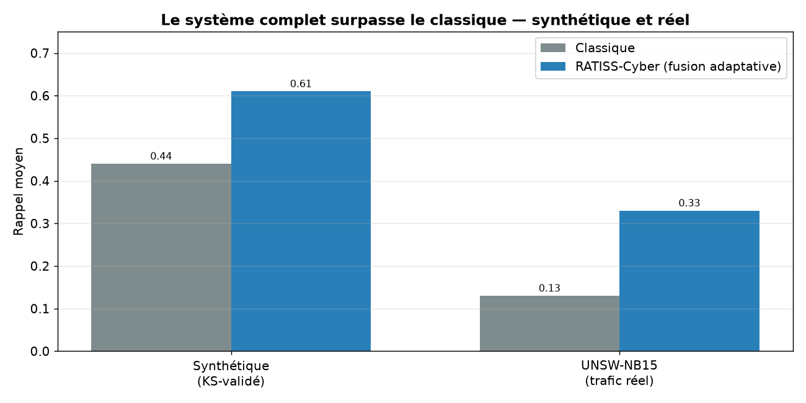
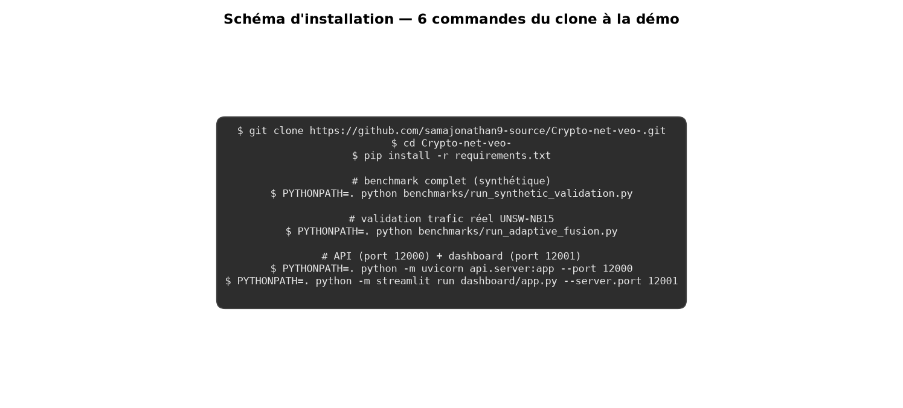
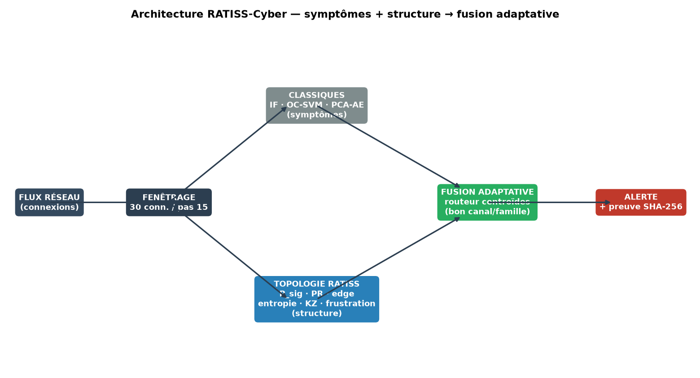
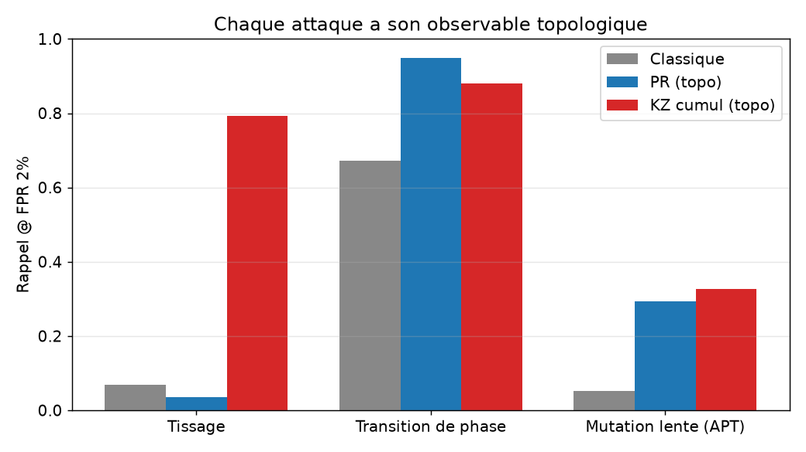
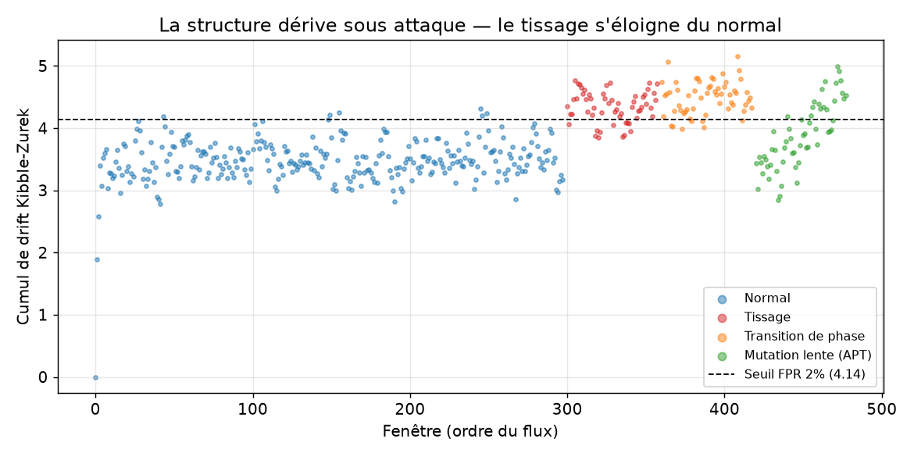
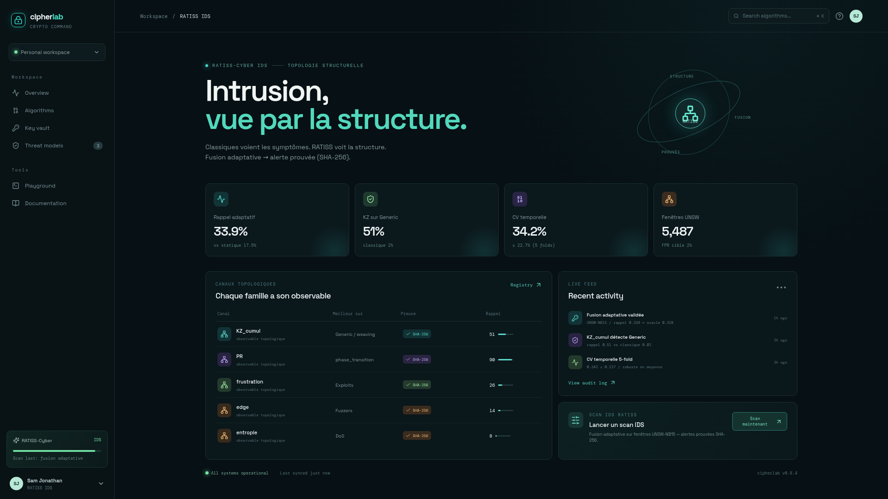

<p align="center">
  
</p>

[](https://github.com/jonathansearch)

# RATISS-Cyber — Intrusion detection by topology of phase transitions

**RATISS Labs POC — Jonathan Evina.** An intrusion detection system (NIDS) that couples
classical detectors (symptoms) with the RATISS topological arsenal
(Vietoris-Rips, P_sig, Kibble-Zurek, frustration). Every alert is **proven**
(SHA-256). Target: SMI CybIA, Douala, November 2026.



On **real** traffic (UNSW-NB15) as well as on KS-validated synthetic data, the
adaptive fusion outperforms the classical approach — and reaches the **oracle bound**.

---

## ⬇️ Installation

```bash
git clone https://github.com/samajonathan9-source/Crypto-net-veo-.git
cd Crypto-net-veo-
pip install -r requirements.txt
```

### Reproduce the benchmarks

```bash
# Proof on synthetic attacks (invisible to stats, KS tests)
PYTHONPATH=. python benchmarks/run_synthetic_validation.py

# Validation on real UNSW-NB15 traffic (175k/87k)
PYTHONPATH=. python benchmarks/run_unsw_validation.py

# Adaptive fusion (centroid router) — oracle bound
PYTHONPATH=. python benchmarks/run_adaptive_fusion.py

# Temporal robustness (TimeSeriesSplit 5-fold)
PYTHONPATH=. python benchmarks/run_temporal_cv.py
```

### Interfaces

```bash
# API (port 12000)
PYTHONPATH=. python -m uvicorn api.server:app --port 12000

# Streamlit dashboard (port 12001)
PYTHONPATH=. python -m streamlit run dashboard/app.py --server.port 12001

# React/Vite web dashboard (optional, port 12003)
cd dashboard/web && npm install --legacy-peer-deps && npx vite preview --port 12003
```



---

## 🧠 Architecture

Network flow → windowing → classical (symptoms) + RATISS topological arsenal
(structure) → adaptive fusion (centroid router) → alert + SHA-256 proof.



---

## 📊 Results (reproducible)

### Unique advantage — controlled synthetic

Attacks designed to be **invisible to statistics** (KS tests ✅):

- **PR** detects the phase transition: recall **0.95** vs 0.67.
- **KZ cumul** detects the weaving: recall **0.79** vs 0.07.



### Real traffic UNSW-NB15

175,341 train / 87,000 test, 9 modern families:

| Family | Classical | Best RATISS |
|---|---|---|
| Generic | 0.02 | **KZ cumul 0.51** |
| Exploits | 0.17 | frustration |
| Fuzzers | 0.14 | edge |
| DoS | 0.07 | entropy |

### Adaptive fusion ≈ oracle bound

| Method | Recall |
|---|---|
| Static | 0.175 |
| **Adaptive (router)** | **0.339** |
| Oracle | 0.328 |

### Temporal robustness (5-fold CV)

**0.342 ± 0.227** — robust on average, variable by regime (documented).
Rupture detection + recalibration helps on Fold 4 (+88%).



---

## 🖥️ Web dashboard (React/Vite)

Premium dark interface with the real metrics: 4 cards (adaptive fusion,
KZ on Generic, temporal CV, UNSW windows), table of the topological channels,
live feed, IDS scan button. Built with shadcn/ui + Tailwind.



See `dashboard/web/README.md` for the details.

---

## 🧰 Repository content

- `ratiss_topo/` — topological engine + arsenal (hysteresis, KZ, frustration, LCT)
- `cyber/` — classical detectors, fusion, adaptive fusion, regime, calibration
- `benchmarks/` — phases 1-5 + UNSW + adaptive + CV + dynamic
- `api/` — FastAPI API (9 channels, SHA-256 proof, KZ memory)
- `dashboard/app.py` — real-time Streamlit dashboard (campaign mode)
- `dashboard/web/` — React/Vite interface (real metrics)
- `datasets/UNSW-NB15/` — dataset (Git LFS)
- `docs/` — phases, figures, LaTeX/PDF paper

## 🗺️ Roadmap

Foundations → coupling → unique advantage → arsenal → fusion + figures →
**SMI CybIA**: UNSW + adaptive + CV + rupture.

## 🙏 Citations

- UNSW-NB15: https://research.unsw.edu.au/projects/unsw-nb15-dataset
- NSL-KDD: https://www.unb.ca/cic/datasets/nsl.html
